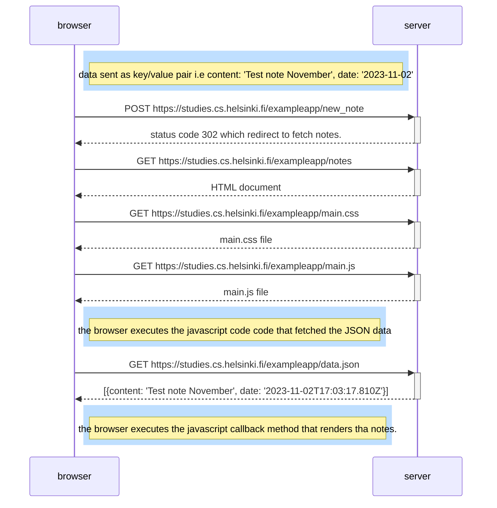
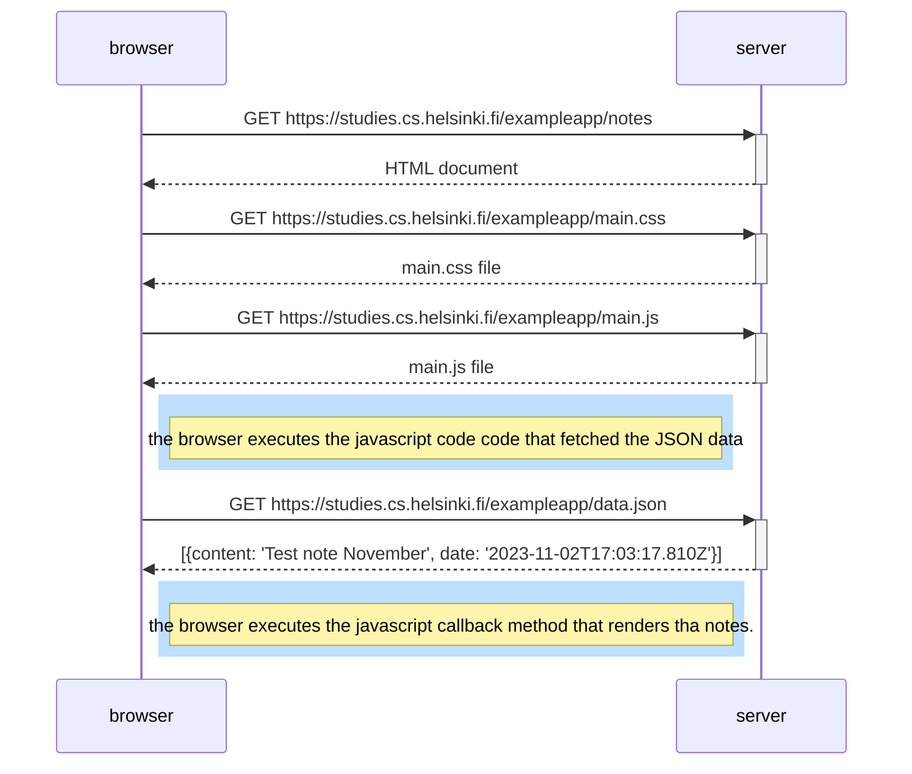
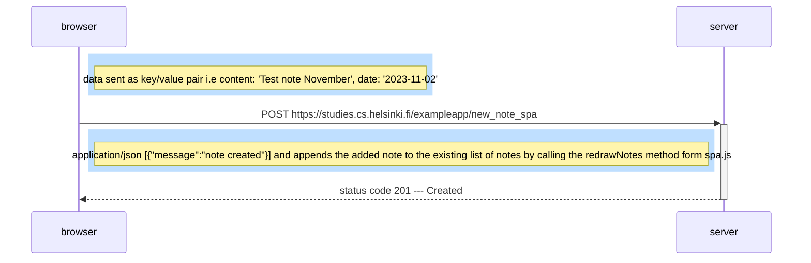

```mermaid
sequenceDiagram
    participant browser
    participant server

    rect rgb(191, 223, 255)
    note right of browser: data sent as key/value pair i.e content: 'Test note November', date: '2023-11-02'
    end
    browser->>+server: POST https://studies.cs.helsinki.fi/exampleapp/new_note
    server-->>-browser: status code 302 which redirect to fetch notes.
    browser->>+server: GET https://studies.cs.helsinki.fi/exampleapp/notes
    server-->>-browser: HTML document
    browser->>+server: GET https://studies.cs.helsinki.fi/exampleapp/main.css
    server-->>-browser: main.css file
    browser->>+server: GET https://studies.cs.helsinki.fi/exampleapp/main.js
    server-->>-browser: main.js file

    rect rgb(191, 223, 255)
    note right of browser: the browser executes the javascript code code that fetched the JSON data
    end
    browser->>+server: GET https://studies.cs.helsinki.fi/exampleapp/data.json
    server-->>-browser: [{content: 'Test note November', date: '2023-11-02T17:03:17.810Z'}]
    rect rgb(191, 223, 255)
    note right of browser: the browser executes the javascript callback method that renders tha notes.
    end
```
### Single page app diagram visit to [https://studies.cs.helsinki.fi/exampleapp/spa]

```mermaid
sequenceDiagram
    participant browser
    participant server
    browser->>+server: GET https://studies.cs.helsinki.fi/exampleapp/notes
    server-->>-browser: HTML document
    browser->>+server: GET https://studies.cs.helsinki.fi/exampleapp/main.css
    server-->>-browser: main.css file
    browser->>+server: GET https://studies.cs.helsinki.fi/exampleapp/main.js
    server-->>-browser: main.js file

    rect rgb(191, 223, 255)
    note right of browser: the browser executes the javascript code code that fetched the JSON data
    end
    browser->>+server: GET https://studies.cs.helsinki.fi/exampleapp/data.json
    server-->>-browser: [{content: 'Test note November', date: '2023-11-02T17:03:17.810Z'}]
    rect rgb(191, 223, 255)
    note right of browser: the browser executes the javascript callback method that renders tha notes.
    end
```
### Single page app diagram visit to [https://studies.cs.helsinki.fi/exampleapp/spa]

```mermaid
sequenceDiagram
    participant browser
    participant server

    rect rgb(191, 223, 255)
    note right of browser: data sent as key/value pair i.e content: 'Test note November', date: '2023-11-02'
    end
    browser->>+server: POST https://studies.cs.helsinki.fi/exampleapp/new_note_spa
        rect rgb(191, 223, 255)
    note right of browser: application/json [{"message":"note created"}] and appends the added note to the existing list of notes by calling the redrawNotes method form spa.js
    end
    server-->>-browser: status code 201 --- Created

```